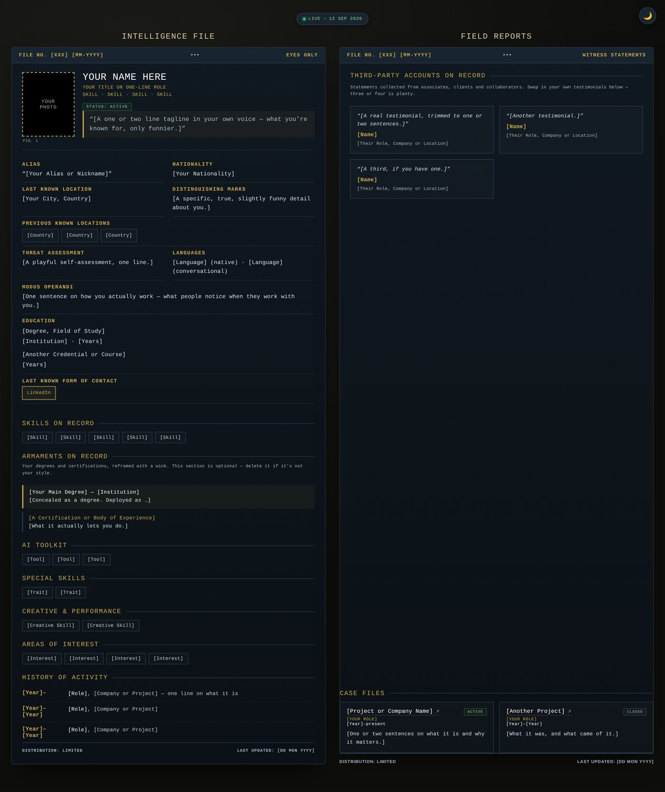

# Your Intelligence File

A playful, spy-dossier-style personal profile and resume template. Turn your bio into a declassified intelligence file, one HTML file, light and dark mode, ready to deploy.

Concept and creative direction by [Jacqueline du Plessis](https://www.linkedin.com/in/jacquelineduplessis/), built with Claude.

**Live example:** [resume.jacquelineduplessis.com](https://www.resume.jacquelineduplessis.com/)



## What's inside

- `index.html` — the entire site: markup, styles, and script in one file. No build step, no dependencies beyond two Google Fonts.
- Every place you need to fill in is marked with `[bracketed placeholder text]`.

## Filling it out with AI (recommended)

The fastest way to populate this template is to hand an AI assistant your LinkedIn profile as a PDF, plus the prompt below. It will pull your factual career details straight from the PDF, then ask you a few questions for the fields LinkedIn doesn't cover.

**Step 1: Export your LinkedIn profile to PDF**

1. Go to your LinkedIn profile page.
2. Click the **More** button (the three dots) near the top of your profile, below your banner image.
3. Select **Save to PDF**. (LinkedIn may generate an "enhanced" profile PDF first — either version works.)
4. LinkedIn downloads a PDF of your profile. That's the file you'll hand to the AI.

**Step 2: Give your chatbot the PDF and this prompt**

Open your favorite AI chat tool (ChatGPT, Claude, Gemini, or similar), attach the PDF from Step 1, and paste in the prompt below. If your tool can't accept file attachments, copy and paste the text of your LinkedIn PDF into the chat instead, right above the prompt.

```
I'm filling out a personal website template called "Your Intelligence File" — a
spy-dossier-style resume. I've attached my LinkedIn profile as a PDF.

Please do the following:

1. Read the attached PDF and pull out my factual career details: name, current
   title, work history, education, certifications, and skills.

2. This template also has some playful, personality-driven fields that
   LinkedIn won't have. Ask me about these one at a time, briefly, before
   filling them in:
   - Alias / codename (a nickname or how people know me)
   - Tagline (one punchy line that sums up what I do)
   - Threat assessment (a tongue-in-cheek label, e.g. "moderate," "high")
   - Modus operandi (my signature way of working or getting results)
   - Distinguishing marks (a fun, identifying quirk or trait)
   - Special skills (soft skills or traits that don't fit neatly as job
     history — my "special training," if you will)
   - Case files (2-4 projects or ventures worth highlighting, with a short
     description of each)
   - Testimonials (a short quote or two from a colleague, client, or manager,
     if I have one handy)
   - Armaments on Record and AI Toolkit (optional — certifications, tools, or
     AI systems I use regularly, framed as "equipment." Skip either section
     if it doesn't apply to me)

3. Once you have everything, either:
   a. If you can edit files directly, open index.html from this repo and
      replace every [bracketed placeholder] with my real information, keeping
      all HTML, CSS, and JavaScript structure exactly as it is; or
   b. If you can't edit files, give me the replacement text for each
      bracketed section, clearly labeled (e.g. "NAME:", "TAGLINE:", "CASE
      FILE 1:") so I can paste each one into index.html myself.

Don't invent details I haven't given you. If something's missing and you're
not sure, ask rather than guessing.
```

The AI will work through your LinkedIn PDF and ask follow-up questions as needed. Once it's done, open `index.html` in a browser to check it over before deploying (see "Deploying it" below).

## Customizing it by hand

Prefer to do it yourself? Open `index.html` in any text editor and work through it top to bottom:

1. **Photo** — replace the `.file-photo-placeholder` block with `` inside `.file-photo`, and delete the `.file-photo-placeholder` CSS rule once you do.
2. **Name and title** — search for `YOUR NAME HERE` and the two placeholder title lines in the `<script>` block near the bottom (they appear twice each: once as a fallback, once in the typewriter animation).
3. **All the bracketed fields** — alias, location, education, skills, history, testimonials, case files. Delete any section you don't want (Armaments on Record and AI Toolkit are both optional flavor sections).
4. **Colors and fonts** — everything is driven by CSS custom properties at the top of the `<style>` block (`--file-navy`, `--file-accent`, etc.), so you can reskin the whole thing without touching layout code.
5. **Links** — the LinkedIn button and case file links currently point to `#`; swap in your real URLs.
6. **SEO and social preview** — the `<head>` has a title, meta description, and Open Graph/Twitter tags so the page looks right when shared on LinkedIn, Slack, etc. Fill in the bracketed fields, including a link to a 1200x630 preview image (the same design system used for `preview.jpg` in this repo works well for that, just swap in your own name and tagline).

## Deploying it

This is a static file, so any static host works. The quickest free option:

1. Push this repo to GitHub.
2. In Cloudflare, go to **Workers & Pages → Create → Pages → Connect to Git**, and select the repo.
3. Leave the build command blank and set the output directory to `/`.
4. Deploy. Every future push updates the live site automatically.

## License

MIT. Use it, modify it, ship it as your own, no attribution required. If you want to credit the original, a link back is appreciated but not expected.

## Notes for future updates (including AI assistants)

This section exists so anyone, or any AI agent, picking this repo up later has the context to work on it without re-deriving it:

- **Keep it a single file.** `index.html` is intentionally self-contained: no build step, no npm, no JS framework. Any edit should stay inline HTML/CSS/JS.
- **Theming is variable-driven.** Colors live in the `:root` CSS custom properties and their `body.theme-light` overrides. Add new colors as variables in both places rather than hardcoding hex values in component rules.
- **Fonts:** Special Elite (headers/typewriter), IBM Plex Mono (body/labels), Oswald (page title). Loaded from Google Fonts in `<head>`.
- **Motion:** the typewriter intro and reveal fade are wrapped in a `prefers-reduced-motion` check. Any new animation should get the same treatment.
- **Placeholders use `[bracketed text]`.** Keep that convention for anything a user needs to fill in themselves.
- **Deployment:** static file, deployed via Cloudflare Pages connected directly to this GitHub repo (no build command, output directory `/`). Pushing to the connected branch redeploys automatically.
- **Workflow:** changes are made to the local repo folder and committed/pushed through GitHub Desktop, not via automated git commands, unless told otherwise.
